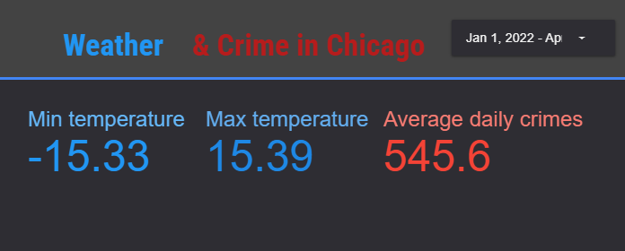

# Weather & Crime in Chicago (2022)

Аналіз впливу погодних факторів (температура, опади) на частоту, характер злочинів у Чикаго.  
Стек: **BigQuery + SQL + Looker Studio**.

## ⚙️ Використані інструменти
- **Google BigQuery** — обробка та агрегація даних  
- **SQL** — формування запитів і розрахунок метрик  
- **Looker Studio** — побудова інтерактивного дашборду  
- **GitHub** — контроль версій і документація проєкту  

## 📦 Дані
- **Злочини**: Chicago Data Portal — *Crimes - 2001 to Present*
- **Погода**: Open-Meteo / VisualCrossing (історичні погодні дані)
- **Одиниці вимірювання**: температура — °C

👉 [Переглянути дашборд у Looker Studio](https://lookerstudio.google.com/reporting/779d1576-7a6d-4495-b8f4-50f122653d1d)

## 🧩 Приклад візуалізації

## 👨‍💻 Автор
**[Andrii Lohinov]** — Junior Data Analyst  
📧 [www.linkedin.com/in/andrii-lohinov]
